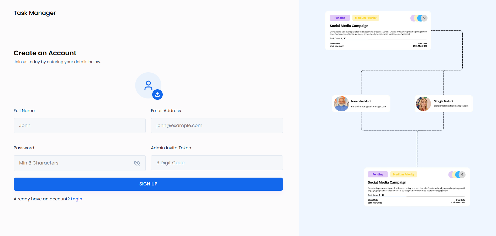

# ✅ Task Manager – Organize. Prioritize. Achieve.

Task Manager is a full-featured productivity web application built with the powerful **MERN Stack** (MongoDB, Express, React, Node.js). From managing daily tasks to tracking progress with intuitive UI and real-time feedback, this app helps users stay productive and focused.

 <!-- Optional: Add screenshot or GIF -->

---

## 🔥 Features

- 🔐 **User Authentication** – Secure login & signup with JWT-based auth.
- 📋 **Create, Read, Update, Delete (CRUD)** – Full control over your tasks.
- 🎯 **Status Tracking** – Manage task states (Pending, In Progress, Completed).
- 🗃️ **User Dashboard** – Personalized view of all your tasks.
- 💾 **Persistent Storage** – MongoDB database integration.
- 📷 **Profile Picture Upload** – Users can personalize their account.
- 🔄 **Responsive UI** – Mobile-friendly, clean, and modern design.
- 🌈 **Toast Notifications** – Smooth feedback for every action.
- ⚙️ **Robust Backend** – Built with Express and follows REST API principles.

---

## 🚀 Getting Started

### 1. Clone the Repository

```bash
git clone https://github.com/VishnuJha100/Task-Manager.git
cd Task-Manager
```

### 2. Setup the Backend
```bash
cd backend
npm install
```

🔑 Create a .env file in /backend with the following:
```ini
PORT=8000
MONGO_URI=your_mongodb_connection_string
JWT_SECRET=your_jwt_secret
```

Then run:
```bash
npm run dev
```

### 3. Setup the Frontend
```bash
cd ../frontend
npm install
```

🔑 Create a .env file in /frontend with the following:
```ini
VITE_BASE_URL=http://localhost:8000
```

Start the Frontend
```bash
npm run dev
```

## 🌐 Live Demo
🔗 https://task-manager-863e.vercel.app/

## 🧱 Project Structure
```pgsql
Task-Manager/
├── backend/
│   ├── controllers/
│   ├── models/
│   ├── routes/
│   ├── middleware/
│   └── server.js
├── frontend/
│   ├── src/
│   │   ├── components/
│   │   ├── pages/
│   │   ├── assets/
│   │   └── App.jsx
│   ├── public/
│   └── index.html
└── README.md
```

## 📦 Tech Stack
- Frontend: React, Vite, Tailwind CSS, Framer Motion, React Hot Toast
- Backend: Node.js, Express.js
- Database: MongoDB Atlas
- Authentication: JWT + bcrypt
- Image Upload: Multer + Cloudinary/local handling

## ✨ Upcoming Features
- 📆 Due Date and Reminders
- 🧾 Task Categories/Labels
- 📊 Analytics Dashboard
- 🌙 Dark Mode
- 🔐 Google OAuth Sign-in
- 📁 File Attachments in Tasks

## 🧠 How It Works
- Users register or log in with secure credentials.
- The app stores task data in MongoDB with user association.
- Tasks are displayed dynamically with status filters.
- Profile picture uploads handled with Multer.
- Authenticated routes protect sensitive operations.

## 📜 License
MIT License © 2025 Vishnu Deb Jha
